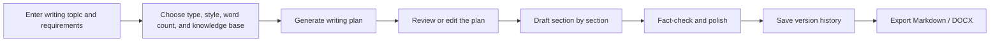
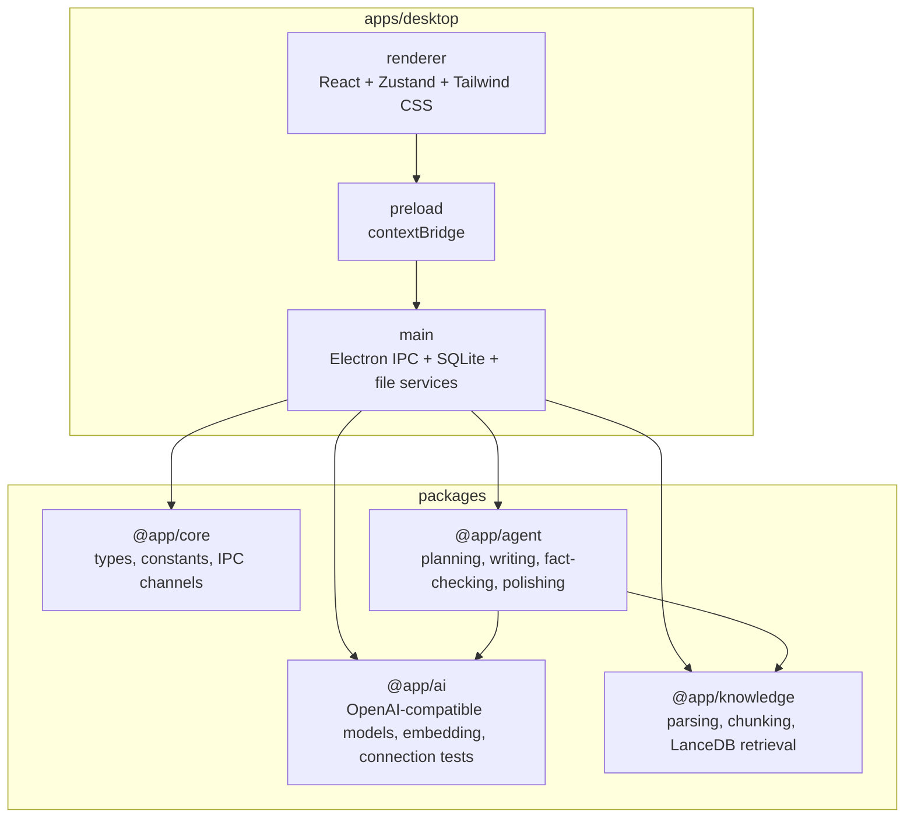

<div align="center">
  

  <h1>Jizhi Writing</h1>

  <p><strong>A local AI writing desktop workspace for office documents</strong></p>
  <p>From source material, writing plans, section-by-section drafting, and polishing to final export, Jizhi Writing turns long-form document creation into a focused, professional, self-configurable desktop workflow.</p>

  <p>
    
    
    
    
    
  </p>

  <p>
    <a href="./README.md">简体中文</a> | English
  </p>
</div>

## Why It Exists for Writing

Jizhi Writing is not a generic chat window, and it is not a model-configuration dashboard that pushes API keys, embedding settings, RAG, prompts, and token details onto the user. It is designed around one goal from the start: help people produce a usable office document. The Agent understands the writing goal, the knowledge base provides factual grounding, style and word count remain controllable, and the final document can be exported directly.

Its core advantages are:

- **An Agent born for writing**: plan the structure first, then draft section by section, fact-check with retrieved context, and polish the language to reduce drift in long documents.
- **A RAG knowledge base for source-grounded writing**: parse local PDF, DOCX, TXT, and Markdown files, then turn company policies, project materials, competitor reports, and personal references into searchable writing context.
- **Precise control over style and length**: generate in formal, concise, professional, friendly, promotional, or government-document styles, with planning and compression around the target word count.
- **A one-click path from generation to delivery**: save writing history automatically and export the final draft as Markdown or DOCX for editing, archiving, or submission.

It is suitable for work summaries, research reports, project proposals, meeting minutes, notices, business emails, promotional copy, policy documents, bidding materials, and custom office documents. It can also serve as a reusable AI writing client foundation for developers.

## Core Capabilities

| Capability | Current implementation |
| --- | --- |
| Writing plan | Generate an editable plan before full drafting, so long-form writing starts from a controlled structure. |
| Section-by-section generation | Draft each section in order while streaming progress and current section updates back to the app. |
| Sub-Agent polishing | Run fact-checking and language polishing after each section to reduce quality drift. |
| Local knowledge base | Upload, parse, chunk, embed, and retrieve PDF, DOCX, TXT, and Markdown documents. |
| OpenAI-compatible models | Use OpenAI, DeepSeek, SiliconFlow, OpenRouter, Ollama, or any custom compatible endpoint. |
| Secure configuration | Configure writing and embedding models separately. API keys are stored in system secure storage instead of plaintext databases. |
| Version history | Save writing projects, generated drafts, and later revisions as versioned records. |
| Document export | Export finished drafts to Markdown or DOCX. |
| Desktop experience | Built with Electron and React, with Writing, Knowledge Base, History, and Settings pages. |

## Workflow



## Architecture



## Quick Start

### Requirements

- Node.js `>= 22`
- pnpm `>= 9`
- macOS or Windows development environment

Corepack is recommended for managing pnpm:

```bash
corepack enable
```

### Install Dependencies

```bash
pnpm install
```

### Start the Desktop App

```bash
pnpm dev
```

### First Run

1. Open the Settings page.
2. Configure a writing model: choose OpenAI, DeepSeek, SiliconFlow, OpenRouter, Ollama, or a custom OpenAI-compatible endpoint.
3. Configure an embedding model: document upload, vectorization, and retrieval depend on this setting.
4. Run the connection test to confirm the model is available.
5. Optional: create a knowledge base and upload PDF, DOCX, TXT, or Markdown files.
6. Return to the Writing page, enter your request, generate a plan, confirm it, and start drafting.

## Commands

| Command | Description |
| --- | --- |
| `pnpm dev` | Start the Electron development environment. |
| `pnpm build` | Build the desktop app. |
| `pnpm test` | Run Vitest tests. |
| `pnpm test:watch` | Run tests in watch mode. |
| `pnpm typecheck` | Run TypeScript checks across workspace packages. |
| `pnpm lint` | Check code style with Biome. |
| `pnpm format` | Apply Biome auto-fixes where available. |

## Repository Structure

```text
.
├── apps/
│   └── desktop/                  # Electron desktop app
│       └── src/
│           ├── main/             # Main process, IPC, database, file services
│           ├── preload/          # Secure bridge layer
│           └── renderer/         # React pages, components, state management
├── packages/
│   ├── agent/                    # Planning, drafting, fact-checking, polishing pipeline
│   ├── ai/                       # OpenAI-compatible endpoints, embedding, token counting
│   ├── core/                     # Shared types, constants, IPC channels
│   └── knowledge/                # Document parsing, chunking, vector storage, retrieval
├── docs/superpowers/             # Design docs and implementation plans
├── package.json
├── pnpm-workspace.yaml
└── vitest.config.ts
```

## Packages

### `@app/agent`

Orchestrates the full writing pipeline:

- `planner.ts`: generates a writing plan from the topic, type, style, word count, and optional knowledge-base context.
- `writer.ts`: drafts the document section by section.
- `sub-agents/fact-check.ts`: corrects factual issues with retrieved reference context.
- `sub-agents/polish.ts`: polishes the language according to the selected style.
- `pipeline.ts`: connects planning, writing, fact-checking, polishing, compression, and progress callbacks.

### `@app/knowledge`

Provides local RAG capabilities:

- Parse PDF, DOCX, TXT, and Markdown.
- Chunk content by heading and paragraph.
- Generate vectors with the configured embedding model.
- Store and retrieve document chunks with LanceDB.
- Keep each knowledge base in an isolated table to reduce cross-project contamination.

### `@app/ai`

Wraps OpenAI-compatible model calls:

- Configure writing and embedding models separately.
- Run connection tests.
- Use custom `baseUrl` and model names.

### `@app/desktop`

Desktop app entry point:

- `main/` handles IPC, SQLite, file import, export, and secure storage.
- `renderer/` provides the Writing workspace, Knowledge Base, History, and Settings pages.
- `preload/` exposes a controlled API through `contextBridge`, so the renderer does not directly access Node capabilities.

## Data and Privacy

- Project data is stored in the local app data directory.
- API keys are written to system secure storage through Electron security APIs.
- Uploaded documents are copied into the local app directory and tracked in SQLite metadata.
- Knowledge-base vectors are stored locally in LanceDB.
- The open-source self-configured edition does not include official accounts, subscriptions, cloud sync, or hosted model credits.

## Contributing

Contributions are welcome in areas such as:

- Writing types and prompt strategy
- Knowledge-base parsing, chunking, retrieval, and citation quality
- Electron packaging, upgrades, and cross-platform compatibility
- UI interaction, accessibility, and long-form editing experience
- Test coverage, error handling, and performance

Recommended local checks:

```bash
pnpm install
pnpm typecheck
pnpm test
pnpm lint
```

Please try to keep TypeScript checks, tests, and Biome checks passing before submitting changes.

## FAQ

### Why does it say "Please configure the writing model API key first"?

Writing plan generation and drafting require a usable writing model. Save the API key, endpoint, and model name in Settings, then run the connection test.

### Why did knowledge-base upload fail?

Knowledge-base vectorization depends on the embedding model configuration. Configure the embedding API key in Settings and make sure the selected model supports embeddings.

### Does it support local models?

Yes. You can use the Ollama preset or enter any OpenAI-compatible endpoint. The writing model and embedding model must both be available for their respective tasks.

### Are prebuilt installers available?

The repository is currently focused on source development and MVP validation. Installer packaging and formal release workflow are not complete yet.

### What is the license?

This project is released under the [Apache License 2.0](./LICENSE).
