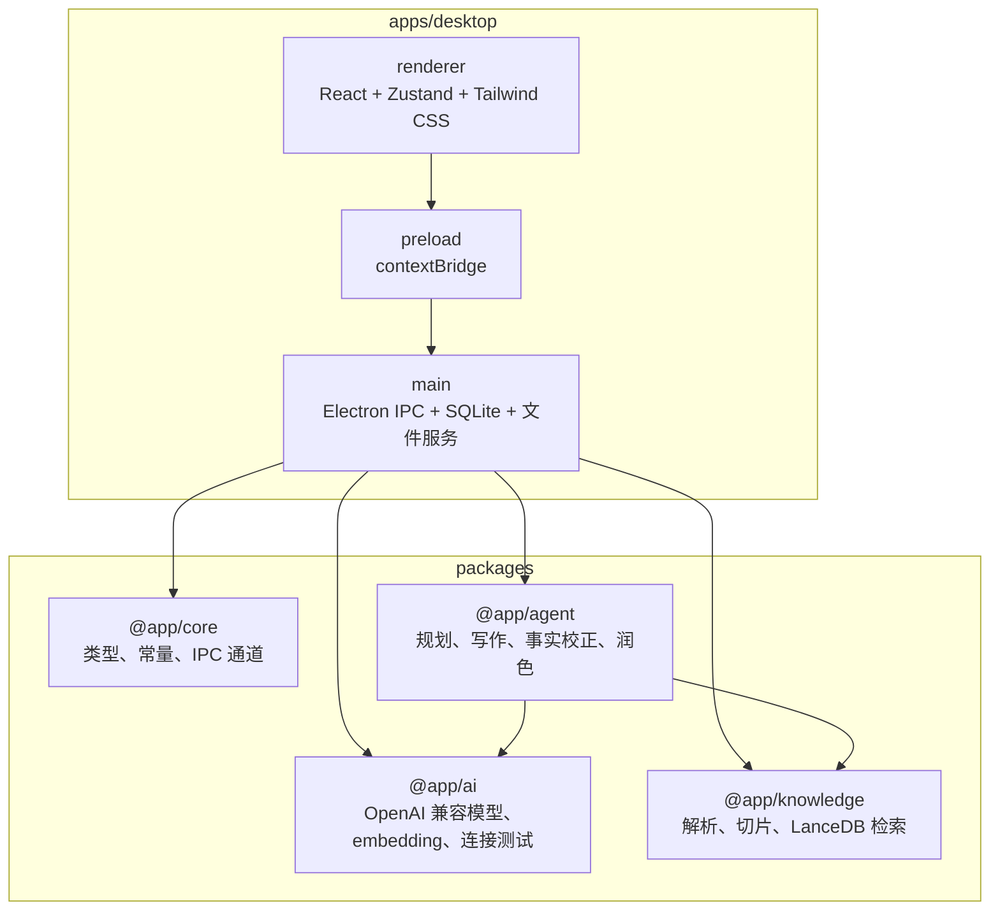

<div align="center">
  

  <h1>极致写作</h1>

  <p><strong>面向办公人员的本地 AI 写作桌面工作台</strong></p>
  <p>从资料整理、写作规划、分段生成到润色导出，把长文写作流程收进一个克制、专业、可自配置的桌面客户端。</p>

  <p>
    
    
    
    
    
  </p>

  <p>
    简体中文 | <a href="./README.en.md">English</a>
  </p>
</div>

## 为什么为写作而做

极致写作不是通用聊天窗口，也不是把模型参数堆给用户的配置后台。它从第一天起就围绕“写出一篇可交付的办公文稿”设计：让 Agent 理解写作目标，让知识库提供事实依据，让风格和字数可控，最后把成稿直接导出为可使用的文档。

它的核心优势是：

- **只为写作而诞生的 Agent**：先规划结构，再分段起草、事实校正、语言润色，避免长文直接生成带来的跑题和失控。
- **面向资料写作的 RAG 知识库**：本地解析 PDF、DOCX、TXT、Markdown，把公司制度、项目资料、竞品报告等变成可检索的写作依据。
- **精准控制语言风格和字数**：按正式、简洁、专业、亲和、宣传、公文等风格生成，并围绕目标篇幅进行规划和压缩。
- **从生成到交付的一键闭环**：历史版本自动保存，成稿可直接导出为 Markdown 或 DOCX，适合继续编辑、归档或提交。

因此，它适合写工作总结、调研报告、项目方案、会议纪要、通知公告、商务邮件、宣传稿、制度文档和招投标材料，也适合开发者作为一个可二次开发的 AI 写作客户端基座。

## 核心能力

| 能力 | 当前实现 |
| --- | --- |
| 写作规划 | 先生成可编辑的写作计划，再进入正式写作，避免直接生成不可控长文。 |
| 分段生成 | 按章节逐段生成正文，并实时回传当前章节和进度。 |
| 子 Agent 润色 | 每段完成后进入事实校正和语言润色流程，降低长文质量漂移。 |
| 本地知识库 | 支持 PDF、DOCX、TXT、Markdown 上传、解析、切片、向量化和检索。 |
| OpenAI 兼容模型 | 支持 OpenAI、DeepSeek、SiliconFlow、OpenRouter、Ollama 和自定义兼容接口。 |
| 安全配置 | 写作模型和嵌入模型分开配置，API Key 存入系统安全存储，不写入明文数据库。 |
| 历史版本 | 写作项目、生成结果和后续修订会保存为版本记录。 |
| 文档导出 | 支持 Markdown 和 DOCX 导出。 |
| 桌面体验 | Electron + React 构建，包含写作、知识库、历史、设置四个主页面。 |

## 工作流


## 技术架构



## 快速开始

### 环境要求

- Node.js `>= 22`
- pnpm `>= 9`
- macOS 或 Windows 开发环境

建议使用 Corepack 管理 pnpm：

```bash
corepack enable
```

### 安装依赖

```bash
pnpm install
```

### 启动桌面客户端

```bash
pnpm dev
```

### 第一次运行

1. 打开“设置”页面。
2. 配置写作模型：选择 OpenAI、DeepSeek、SiliconFlow、OpenRouter、Ollama 或自定义 OpenAI 兼容接口。
3. 配置嵌入模型：知识库上传、向量化和检索依赖该配置。
4. 点击连接测试，确认模型可用。
5. 可选：创建知识库并上传 PDF、DOCX、TXT 或 Markdown 文件。
6. 回到写作页，输入需求，生成规划，确认后开始写作。

## 常用命令

| 命令 | 说明 |
| --- | --- |
| `pnpm dev` | 启动 Electron 开发环境。 |
| `pnpm build` | 构建桌面应用。 |
| `pnpm test` | 运行 Vitest 测试。 |
| `pnpm test:watch` | 以 watch 模式运行测试。 |
| `pnpm typecheck` | 对 workspace 内包执行 TypeScript 检查。 |
| `pnpm lint` | 使用 Biome 检查代码风格。 |
| `pnpm format` | 使用 Biome 自动修复可格式化问题。 |

## 目录结构

```text
.
├── apps/
│   └── desktop/                  # Electron 桌面应用
│       └── src/
│           ├── main/             # 主进程、IPC、数据库、文件服务
│           ├── preload/          # 安全桥接层
│           └── renderer/         # React 页面、组件、状态管理
├── packages/
│   ├── agent/                    # 写作规划、正文生成、事实校正、润色编排
│   ├── ai/                       # OpenAI 兼容接口、embedding、token 估算
│   ├── core/                     # 共享类型、常量、IPC channel
│   └── knowledge/                # 文档解析、切片、向量存储、检索
├── docs/superpowers/             # 设计文档与实现计划
├── package.json
├── pnpm-workspace.yaml
└── vitest.config.ts
```

## 模块说明

### `@app/agent`

负责编排完整写作链路：

- `planner.ts`：根据主题、类型、风格、字数和知识库上下文生成写作计划。
- `writer.ts`：按章节生成正文。
- `sub-agents/fact-check.ts`：结合检索资料校正事实。
- `sub-agents/polish.ts`：按语言风格润色。
- `pipeline.ts`：串联规划、写作、校正、润色、压缩和进度回调。

### `@app/knowledge`

提供本地 RAG 能力：

- 解析 PDF、DOCX、TXT、Markdown。
- 按标题和段落切片。
- 使用 embedding 模型生成向量。
- 以 LanceDB 存储和检索文档切片。
- 每个知识库独立建表，减少不同资料互相污染。

### `@app/ai`

封装 OpenAI 兼容模型调用：

- 写作模型和嵌入模型分开配置。
- 支持连接测试。
- 支持自定义 `baseUrl` 和模型名称。

### `@app/desktop`

桌面端入口：

- `main/` 负责 IPC、SQLite、文件导入、导出和安全存储。
- `renderer/` 负责写作工作台、知识库、历史记录和设置页面。
- `preload/` 通过 `contextBridge` 暴露受控 API，避免 renderer 直接访问 Node 能力。

## 数据与隐私

- 项目数据保存在应用本地数据目录。
- API Key 通过 Electron 安全能力写入系统安全存储。
- 文档上传后会复制到本地应用目录，并写入 SQLite 元数据。
- 知识库向量存储在本地 LanceDB。
- 开源自配置版不会内置官方账号、订阅、云同步或模型额度。

## 路线图

- [x] Electron 桌面客户端
- [x] OpenAI 兼容模型配置
- [x] 写作计划生成与人工确认
- [x] 分段写作、事实校正、润色
- [x] 本地知识库与 RAG 检索
- [x] Markdown / DOCX 导出
- [x] 历史项目与版本保存
- [ ] 安装包打包与发布流程
- [ ] 更完整的知识库引用溯源
- [ ] 批量文档导入体验优化
- [ ] OCR、PPT、Excel 等更多格式解析
- [ ] 商业版账号、订阅、额度和云同步能力

## 贡献指南

欢迎围绕以下方向贡献：

- 写作类型和提示词策略优化
- 知识库解析、切片、检索和引用质量提升
- Electron 打包、升级和跨平台兼容性
- UI 交互、无障碍和长文编辑体验
- 测试覆盖、错误处理和性能优化

建议流程：

```bash
pnpm install
pnpm typecheck
pnpm test
pnpm lint
```

提交前请尽量保证类型检查、测试和 Biome 检查通过。

## 常见问题

### 为什么提示“请先配置写作模型 API Key”？

写作规划和正文生成需要可用的写作模型。请在设置页保存 API Key、接口地址和模型名称，并先执行连接测试。

### 为什么知识库上传失败？

知识库向量化依赖嵌入模型配置。请先在设置页配置嵌入模型 API Key，并确认对应模型支持 embedding。

### 支持本地模型吗？

支持。可以选择 Ollama 预设，或填写任意 OpenAI 兼容接口地址。写作模型和嵌入模型需要分别可用。

### 当前有预编译安装包吗？

仓库目前以源码开发和 MVP 验证为主，安装包打包与正式发布流程仍在路线图中。

### 许可证是什么？

当前仓库尚未附带 `LICENSE` 文件。正式公开发布前，建议补充明确的开源许可证。

## README 设计参考

本 README 的信息组织参考了 GitHub 官方 README 建议，以及 Next.js、Vite、Supabase 等高星仓库常见写法：首屏说明价值、用徽章建立可信度、快速给出上手命令，再提供架构、模块、路线图和贡献入口。
